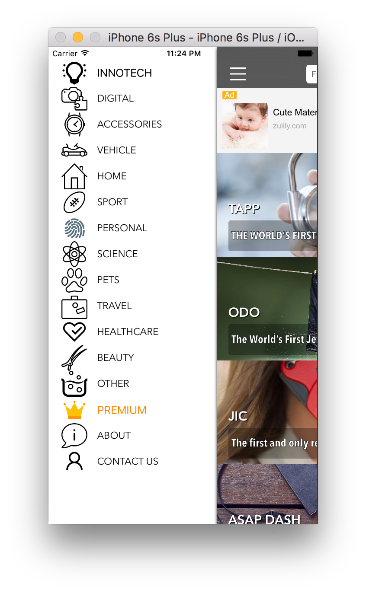

# InnoTech

<p align="center">




</p>


## Requirements

- iOS 8.0+ / Mac OS X 10.9+
- Xcode 7.3+

## Installation

### CocoaPods

[CocoaPods](http://cocoapods.org) is a dependency manager for Cocoa projects. You can install it with the following command:

```bash
$ gem install cocoapods
```

> CocoaPods 0.39.0+ is required to build InnoTech

To launch InnoTech project in your Xcode using CocoaPods, navigate to project directory and run the following command:

```bash
$ pod install
```
---

## Libraries used

- AFNetworking
- Facebook
- Helpshift
- SDWebImage
- Firebase

## License

InnoTech is released under the GNU GENERAL PUBLIC LICENSE. See LICENSE for details.
